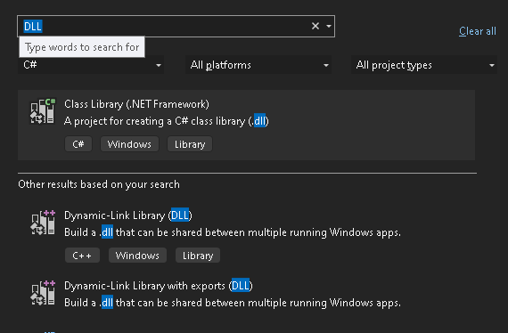

# Injecting Code into a Process

This guide explains how to insert a DLL into a running Windows process. The method involves interacting with the process memory and creating threads to load the DLL.

## Process Overview
We use the Windows API to:

- Locate the target process.
- Reserve space in the process memory.
- Write the DLL path into that space.
- Run the `LoadLibraryA` function to load the DLL.

This example targets `explorer.exe` and injects `example.dll` located in the user's system.

## Code and Functions

### Setting Up

To start, include the necessary headers:

```cpp
#include <windows.h>
#include <tlhelp32.h>
#include <iostream>
```

### Finding the Target Process

You need the Process ID (PID) of the target process. Here's how to find it:

```cpp
DWORD GetPID(const std::wstring& processName) {
    DWORD pid = 0;
    PROCESSENTRY32W process;
    process.dwSize = sizeof(PROCESSENTRY32W);

    HANDLE snapshot = CreateToolhelp32Snapshot(TH32CS_SNAPPROCESS, 0);
    if (snapshot == INVALID_HANDLE_VALUE) return 0;

    if (Process32FirstW(snapshot, &process)) {
        do {
            if (processName == process.szExeFile) {
                pid = process.th32ProcessID;
                break;
            }
        } while (Process32NextW(snapshot, &process));
    }
    CloseHandle(snapshot);
    return pid;
}
```

### Injecting the DLL

Once you have the PID, use these steps:

1. Open the process:

```cpp
HANDLE OpenTargetProcess(DWORD pid) {
    return OpenProcess(PROCESS_ALL_ACCESS, FALSE, pid);
}
```

2. Allocate memory for the DLL path:

```cpp
LPVOID AllocateMemory(HANDLE process, const char* path) {
    return VirtualAllocEx(process, NULL, strlen(path) + 1, MEM_COMMIT, PAGE_READWRITE);
}
```

3. Write the DLL path:

```cpp
bool WriteDLLPath(HANDLE process, LPVOID remoteMemory, const char* path) {
    return WriteProcessMemory(process, remoteMemory, path, strlen(path) + 1, NULL);
}
```

4. Execute the thread to load the DLL:

```cpp
bool RunRemoteThread(HANDLE process, LPVOID remoteMemory) {
    LPVOID loadLibraryAddr = GetProcAddress(GetModuleHandle(L"kernel32.dll"), "LoadLibraryA");
    if (loadLibraryAddr == NULL) return false;

    HANDLE thread = CreateRemoteThread(process, NULL, 0, (LPTHREAD_START_ROUTINE)loadLibraryAddr, remoteMemory, 0, NULL);
    if (thread == NULL) return false;

    WaitForSingleObject(thread, INFINITE);
    CloseHandle(thread);
    return true;
}
```

### Main Function

```cpp
int main() {
    std::wstring target = L"explorer.exe";
    DWORD pid = GetPID(target);
    if (pid == 0) {
        std::cerr << "Target not found." << std::endl;
        return 1;
    }

    const char* dllPath = "C:\\Path\\To\\example.dll";

    HANDLE process = OpenTargetProcess(pid);
    if (process == NULL) {
        std::cerr << "Failed to open process." << std::endl;
        return 1;
    }

    LPVOID remoteMemory = AllocateMemory(process, dllPath);
    if (remoteMemory == NULL) {
        std::cerr << "Memory allocation failed." << std::endl;
        CloseHandle(process);
        return 1;
    }

    if (!WriteDLLPath(process, remoteMemory, dllPath)) {
        std::cerr << "Failed to write memory." << std::endl;
        VirtualFreeEx(process, remoteMemory, 0, MEM_RELEASE);
        CloseHandle(process);
        return 1;
    }

    if (!RunRemoteThread(process, remoteMemory)) {
        std::cerr << "Thread creation failed." << std::endl;
    } else {
        std::cout << "DLL injected successfully!" << std::endl;
    }

    VirtualFreeEx(process, remoteMemory, 0, MEM_RELEASE);
    CloseHandle(process);
    return 0;
}
```

## Example DLL

Here's the basic structure of a DLL that displays a message box:



```cpp
#include <windows.h>

BOOL WINAPI DllMain(HINSTANCE hinstDLL, DWORD fdwReason, LPVOID lpReserved) {
    if (fdwReason == DLL_PROCESS_ATTACH) {
        MessageBox(NULL, "DLL Injected!", "Notification", MB_OK);
    }
    return TRUE;
}
```

## Notes

This example is a simplified implementation for educational purposes. Always ensure you have permission before performing such actions.
